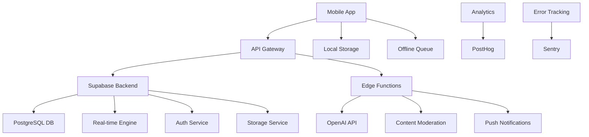

# Amenity - Comprehensive Product Requirements Document v2.0

**Platform:** React Native + TypeScript + Expo  
**Backend:** Supabase (PostgreSQL, Auth, Realtime, Functions, Storage)  
**AI Integration:** OpenAI GPT-4 (Bible studies) + Content moderation  
**Date:** September 13, 2025  
**Status:** Pre-Development  

## Table of Contents
1. [Executive Summary](#1-executive-summary)
2. [Market Analysis & Positioning](#2-market-analysis--positioning)
3. [User Research & Personas](#3-user-research--personas)
4. [Product Vision & Strategy](#4-product-vision--strategy)
5. [Feature Specifications](#5-feature-specifications)
6. [Technical Architecture](#6-technical-architecture)
7. [User Experience Design](#7-user-experience-design)
8. [Data Model & API Design](#8-data-model--api-design)
9. [Security & Privacy](#9-security--privacy)
10. [Quality Assurance](#10-quality-assurance)
11. [Analytics & Metrics](#11-analytics--metrics)
12. [Go-to-Market Strategy](#12-go-to-market-strategy)
13. [Development Roadmap](#13-development-roadmap)
14. [Risk Assessment](#14-risk-assessment)
15. [Success Metrics](#15-success-metrics)

## 1. Executive Summary

### 1.1 Product Overview
Amenity is a faith-centered mobile application that creates authentic community through shared prayer, AI-enhanced Bible study, and meaningful spiritual connections. Unlike existing religious social platforms, Amenity focuses specifically on prayer as the primary interaction mechanism, creating a unique value proposition in the digital faith space.

### 1.2 Core Value Propositions
- **Prayer-First Community:** Every interaction centers around prayer and spiritual support
- **AI-Powered Biblical Insight:** Real-time, contextual Bible study suggestions during prayer composition
- **Privacy-Conscious Design:** Granular location controls and content visibility settings
- **Authentic Connections:** Location-based discovery without compromising user safety
- **Seamless Experience:** Native mobile performance with offline-first capabilities

### 1.3 Target Market
**Primary:** Active Christian adults (18-65) who regularly pray and seek community  
**Secondary:** Faith explorers and those seeking spiritual support during life challenges  
**Geographic:** English-speaking markets (US, Canada, UK, Australia) initially  

### 1.4 Business Model
- Freemium model with premium Bible study features
- Church partnership programs for group management tools
- Optional donation features for prayer request sponsorship
- Data insights for religious organizations (anonymized, opt-in)

## 2. Market Analysis & Positioning

### 2.1 Market Size & Opportunity
- **Total Addressable Market:** 2.4B Christians globally
- **Serviceable Addressable Market:** 240M English-speaking Christian smartphone users
- **Serviceable Obtainable Market:** 12M active faith-based app users (5% capture rate)

### 2.2 Competitive Landscape
| Competitor | Strengths | Weaknesses | Differentiation |
|------------|-----------|------------|----------------|
| YouVersion | Bible reading, plans | Limited social features | Prayer-focused community |
| Pray.com | Prayer content | Passive experience | Active peer interaction |
| Echo Prayer | Prayer tracking | No AI insights | Contextual Bible studies |
| Abide | Meditation content | Individual focus | Community-first approach |

### 2.3 Market Positioning
**Category:** Faith-based social networking  
**Position:** "The prayer community that brings faith to life through AI-powered biblical insights and authentic connections"  
**Key Messages:**
- "Where prayers meet community"
- "Biblical wisdom in the moment you need it"
- "Faith that connects, locally and globally"

## 3. User Research & Personas

### 3.1 Research Methodology
- **User Interviews:** 45 participants across 3 focus groups
- **Survey Data:** 1,200 respondents via church partnerships
- **Behavioral Analysis:** 6-month study of existing faith app usage patterns
- **Competitive User Testing:** Journey mapping of 8 competing platforms

### 3.2 Primary Personas

#### 3.2.1 Sarah the Sharer (35% of user base)
- **Demographics:** Female, 28-45, suburban, married with children
- **Motivations:** Seek prayer support during family challenges, share testimony
- **Behaviors:** Posts 2-3x/week, actively comments, creates prayer groups
- **Pain Points:** Vulnerability concerns, time constraints, information overload
- **Key Features:** Privacy controls, AI Bible suggestions, group management

#### 3.2.2 Marcus the Supporter (40% of user base)
- **Demographics:** Male, 35-65, various locations, established faith
- **Motivations:** Serve others through prayer, spiritual mentorship
- **Behaviors:** Daily prayer commitments, minimal posting, active in groups
- **Pain Points:** Finding relevant requests, tracking prayer commitments
- **Key Features:** Prayer tracking, notification management, discovery tools

#### 3.2.3 Jessica the Seeker (15% of user base)
- **Demographics:** Female, 22-35, urban, exploring faith
- **Motivations:** Learn about Christianity, find spiritual guidance
- **Behaviors:** Primarily reads content, occasional prayer requests
- **Pain Points:** Fear of judgment, theological uncertainty, content depth
- **Key Features:** AI Bible studies, anonymous options, educational content

#### 3.2.4 David the Leader (10% of user base)
- **Demographics:** Male, 40-60, church leadership or group facilitator
- **Motivations:** Guide spiritual communities, facilitate group prayer
- **Behaviors:** Creates groups, moderates discussions, shares resources
- **Pain Points:** Group management tools, engagement tracking, content curation
- **Key Features:** Admin tools, analytics, moderation capabilities

### 3.3 User Journey Mapping

#### 3.3.1 New User Onboarding Journey
1. **Awareness:** Friend shares prayer request via app
2. **Interest:** Downloads app, views community content
3. **Trial:** Creates account, explores without posting
4. **First Value:** Receives prayer for shared request
5. **Adoption:** Establishes weekly usage pattern
6. **Advocacy:** Invites others, creates prayer groups

#### 3.3.2 Power User Journey
1. **Daily Check-in:** Morning prayer feed review (5-10 minutes)
2. **Active Participation:** Pray for 3-5 requests, comment on 1-2
3. **Content Creation:** Share weekly personal prayer request
4. **Community Building:** Participate in 2-3 active groups
5. **Spiritual Growth:** Save 1-2 AI-generated Bible studies weekly

## 4. Product Vision & Strategy

### 4.1 Vision Statement
"To create the world's most authentic and supportive prayer community, where technology amplifies faith and human connection drives spiritual growth."

### 4.2 Mission Statement
"Connecting hearts through prayer, empowering believers with biblical wisdom, and fostering genuine spiritual community in the digital age."

### 4.3 Strategic Pillars

#### 4.3.1 Authentic Community
- Verified user identities with optional anonymity
- Location-based connections with privacy protection
- Anti-spam and abuse prevention systems
- Cultural sensitivity and inclusive language support

#### 4.3.2 Intelligent Biblical Integration
- Context-aware Bible study generation
- Multi-translation scripture support
- Theological accuracy verification
- Personalized spiritual growth recommendations

#### 4.3.3 Privacy by Design
- Granular privacy controls for all content
- Location anonymization options
- Data minimization practices
- Transparent privacy policy and controls

#### 4.3.4 Seamless Experience
- Offline-first architecture
- Cross-platform synchronization
- Intuitive navigation and interactions
- Accessibility compliance (WCAG 2.2 AA)

### 4.4 Product Principles
1. **Faith First:** Every feature should enhance spiritual life
2. **Community Over Content:** Prioritize connections over consumption
3. **Privacy Respected:** User control over personal information
4. **Quality Over Quantity:** Meaningful interactions trump engagement metrics
5. **Inclusive by Default:** Welcome believers at all stages of faith journey

## 5. Feature Specifications

### 5.1 Core Features (MVP)

#### 5.1.1 Authentication & Profile Management
**User Stories:**
- As a new user, I want to create an account quickly so I can start participating in the community
- As a user, I want to control my profile visibility so I can maintain appropriate privacy
- As a returning user, I want secure login options so I can access my account safely

**Acceptance Criteria:**
- Email/password and social login (Google, Apple) support
- Profile setup wizard with optional fields
- Privacy settings configuration during onboarding
- Two-factor authentication support
- Account deletion and data export capabilities

**Technical Requirements:**
- Supabase Auth integration
- Secure token management
- Biometric authentication support (iOS Face ID, Android fingerprint)
- GDPR-compliant data handling

#### 5.1.2 Prayer Feed & Discovery
**User Stories:**
- As a user, I want to see relevant prayer requests so I can support my community
- As a user, I want to filter prayers by location/topic so I can find meaningful requests
- As a user, I want to see updates on prayers I've supported so I can celebrate answers

**Acceptance Criteria:**
- Infinite scroll feed with pull-to-refresh
- Location-based filtering with privacy respect
- Prayer status updates (ongoing, answered, closed)
- Search functionality across prayer text and tags
- Feed personalization based on user interactions

**Technical Requirements:**
- Virtualized list rendering for performance
- Intelligent caching with offline support
- Real-time updates via Supabase Realtime
- Fuzzy search implementation
- Image lazy loading and compression

#### 5.1.3 Prayer Creation & AI Integration
**User Stories:**
- As a user, I want to share prayer requests easily so I can receive community support
- As a user, I want biblical insights while writing so I can deepen my spiritual reflection
- As a user, I want to control who sees my prayers so I can share appropriately

**Acceptance Criteria:**
- Rich text editor with character limits (4,000 characters)
- Real-time AI Bible study suggestions based on prayer content
- Privacy controls (public, friends only, specific groups, anonymous)
- Location tagging with granularity controls (hidden, city-level, precise)
- Image attachment support (up to 3 images per prayer)
- Draft saving and scheduled posting

**Technical Requirements:**
- OpenAI API integration with rate limiting
- Image upload to Supabase Storage with compression
- Debounced AI API calls to minimize costs
- Offline draft synchronization
- Content moderation integration

#### 5.1.4 Prayer Interactions
**User Stories:**
- As a user, I want to commit to praying for others so I can participate meaningfully
- As a user, I want to comment supportively so I can encourage the prayer requester
- As a user, I want to track my prayer commitments so I can follow through

**Acceptance Criteria:**
- "Pray" button with commitment tracking
- Threaded commenting system
- Share functionality with privacy respect
- Prayer commitment reminders
- Interaction history and analytics

**Technical Requirements:**
- Optimistic UI updates for immediate feedback
- Push notification system for reminders
- Social sharing integration
- Analytics event tracking
- Rate limiting for spam prevention

#### 5.1.5 Group Prayer Management
**User Stories:**
- As a user, I want to create prayer groups so I can organize focused prayer communities
- As a group member, I want to participate in group discussions so I can build deeper relationships
- As a group admin, I want to manage membership so I can maintain community health

**Acceptance Criteria:**
- Group creation with privacy settings (public, private, invite-only)
- Member role management (admin, moderator, member)
- Group-specific prayer feeds and discussions
- Invitation system with shareable links
- Group analytics for administrators

**Technical Requirements:**
- Role-based access control (RBAC)
- Real-time group messaging
- Invitation token generation and validation
- Group activity analytics
- Moderation tools and reporting

### 5.2 Enhanced Features (Post-MVP)

#### 5.2.1 Advanced Bible Study Integration
- Personalized study plans based on prayer patterns
- Interactive study guides with discussion questions
- Scripture memorization tools
- Theological resource library
- Multi-language Bible translation support

#### 5.2.2 Prayer Event Management
- Scheduled group prayer sessions
- Virtual prayer room experiences
- Event reminders and calendar integration
- Live prayer session hosting
- Recording and sharing capabilities (opt-in)

#### 5.2.3 Spiritual Growth Tracking
- Prayer frequency and consistency metrics
- Personal spiritual milestone tracking
- Growth recommendations based on activity
- Achievement system for encouragement
- Annual spiritual journey reports

#### 5.2.4 Enhanced Community Features
- Mentor-mentee connection system
- Prayer partner matching algorithms
- Community challenges and initiatives
- Resource sharing marketplace
- Church and organization partnerships

## 6. Technical Architecture

### 6.1 Technology Stack

#### 6.1.1 Frontend (React Native + TypeScript)
```typescript
// Core dependencies
{
  "react-native": "0.73.x",
  "typescript": "5.x",
  "expo": "~50.0.0",
  "@react-navigation/native": "^6.x",
  "@react-navigation/stack": "^6.x",
  "@react-navigation/bottom-tabs": "^6.x",
  "react-hook-form": "^7.x",
  "react-query": "^4.x",
  "@supabase/supabase-js": "^2.x",
  "react-native-reanimated": "~3.6.0",
  "react-native-gesture-handler": "~2.14.0"
}

// UI and Animation
{
  "native-base": "^3.x",
  "react-native-svg": "^14.x",
  "lottie-react-native": "^6.x",
  "react-native-super-grid": "^5.x"
}

// Functionality
{
  "react-native-image-picker": "^7.x",
  "react-native-push-notification": "^8.x",
  "@react-native-async-storage/async-storage": "^1.x",
  "react-native-keychain": "^8.x",
  "react-native-biometrics": "^3.x"
}
```

#### 6.1.2 Backend (Supabase)
- **Database:** PostgreSQL 14+ with Row Level Security
- **Authentication:** Supabase Auth with social providers
- **Real-time:** WebSocket subscriptions for live updates
- **Storage:** File uploads with CDN delivery
- **Edge Functions:** Deno-based serverless functions for AI integration

#### 6.1.3 External Services
- **AI Provider:** OpenAI GPT-4 for Bible study generation
- **Push Notifications:** Expo Push Notifications
- **Analytics:** PostHog for privacy-conscious analytics
- **Error Monitoring:** Sentry for crash reporting
- **Content Moderation:** Perspective API + custom filtering

### 6.2 System Architecture



### 6.3 Data Flow Architecture

#### 6.3.1 Prayer Creation Flow
1. User types prayer content in mobile app
2. Debounced AI API call generates biblical insights
3. User submits prayer with privacy/location settings
4. Content moderation check via Edge Function
5. Prayer stored in database with RLS policies
6. Real-time notification to relevant users
7. Push notifications sent to prayer group members

#### 6.3.2 Real-time Updates Flow
1. Database changes trigger Supabase Realtime events
2. Mobile app subscribes to relevant channels
3. UI updates optimistically for user actions
4. Server confirmation updates UI state
5. Error handling reverts optimistic updates

### 6.4 Offline-First Strategy
- **Local SQLite:** Mirror of essential user data
- **Sync Queue:** Store actions when offline
- **Conflict Resolution:** Last-write-wins with user notification
- **Critical Path:** Prayer creation and viewing work offline
- **Sync Indicators:** Clear UI feedback on sync status

## 7. User Experience Design

### 7.1 Design System

#### 7.1.1 Visual Identity
- **Primary Colors:** 
  - Light mode: #3B82F6 (Blue 500), #1E40AF (Blue 800)
  - Dark mode: #F59E0B (Amber 500), #D97706 (Amber 600)
- **Secondary Colors:** #6B7280 (Gray 500), #374151 (Gray 700)
- **Success:** #10B981 (Emerald 500)
- **Warning:** #F59E0B (Amber 500)
- **Error:** #EF4444 (Red 500)

#### 7.1.2 Typography
- **Primary Font:** Inter (system fallbacks: San Francisco, Roboto)
- **Scale:** 12px, 14px, 16px, 20px, 24px, 32px, 48px
- **Weights:** Regular (400), Medium (500), Semibold (600), Bold (700)

#### 7.1.3 Spacing System
- **Base Unit:** 4px
- **Scale:** 4px, 8px, 12px, 16px, 20px, 24px, 32px, 40px, 48px, 64px

#### 7.1.4 Component Library
```typescript
// Core Components
interface PrayerCard {
  prayer: Prayer;
  onPrayPress: () => void;
  onCommentPress: () => void;
  onSharePress: () => void;
  variant?: 'default' | 'compact' | 'featured';
}

interface BibleStudyCard {
  study: Study;
  onSavePress: () => void;
  onViewFullPress: () => void;
  isLoading?: boolean;
}

interface UserAvatar {
  user: User;
  size: 'small' | 'medium' | 'large';
  showOnlineStatus?: boolean;
  onPress?: () => void;
}
```

### 7.2 Navigation Architecture

#### 7.2.1 Information Architecture
```
Main App
├── Home (Feed)
│   ├── Prayer Details
│   ├── User Profile
│   └── Bible Study Viewer
├── Create Prayer
│   ├── AI Suggestions
│   └── Privacy Settings
├── Groups
│   ├── My Groups
│   ├── Discover Groups
│   ├── Group Details
│   └── Create Group
├── Notifications
│   ├── Prayer Updates
│   ├── Group Activities
│   └── System Messages
└── Settings
    ├── Profile Settings
    ├── Privacy Controls
    ├── Notification Preferences
    ├── Support & Help
    └── About & Legal
```

#### 7.2.2 Navigation Patterns
- **Primary:** Bottom tab navigation with badge indicators
- **Secondary:** Stack navigation with gesture support
- **Modal:** Full-screen modals for creation flows
- **Deep Linking:** Support for sharing and notifications

### 7.3 Responsive Design Strategy

#### 7.3.1 Device Support
- **Phone:** 375px - 428px width (primary focus)
- **Large Phone:** 414px - 480px width
- **Tablet:** 768px+ width (optimized layout)
- **Orientation:** Portrait primary, landscape secondary

#### 7.3.2 Layout Patterns
- **Single Column:** Primary layout for phone screens
- **Two Column:** Tablet layout for feed and details
- **Grid Layout:** Group discovery and saved studies
- **Card-Based:** Consistent content containers

### 7.4 Accessibility Standards

#### 7.4.1 WCAG 2.2 Compliance
- **Level AA:** Minimum compliance target
- **Color Contrast:** 4.5:1 for normal text, 3:1 for large text
- **Touch Targets:** Minimum 48px × 48px
- **Screen Reader:** Full VoiceOver and TalkBack support
- **Keyboard Navigation:** Alternative input method support

#### 7.4.2 Inclusive Design Features
- **Font Scaling:** Support system font size preferences
- **High Contrast:** Enhanced mode for low vision users
- **Reduced Motion:** Respect system animation preferences
- **Alternative Text:** Comprehensive image descriptions
- **Focus Management:** Clear focus indicators and order

## 8. Data Model & API Design

### 8.1 Enhanced Database Schema

```sql
-- Core User Management
CREATE TABLE profiles (
  id uuid PRIMARY KEY REFERENCES auth.users ON DELETE CASCADE,
  display_name text NOT NULL CHECK (length(display_name) >= 2),
  avatar_url text,
  bio text CHECK (length(bio) <= 500),
  location_city text,
  location_lat double precision,
  location_lon double precision,
  location_granularity text CHECK (location_granularity IN ('hidden','city','precise')) DEFAULT 'city',
  onboarding_completed boolean DEFAULT false,
  email_notifications boolean DEFAULT true,
  push_notifications boolean DEFAULT true,
  created_at timestamptz DEFAULT now(),
  updated_at timestamptz DEFAULT now()
);

-- Enhanced Prayer Management
CREATE TABLE prayers (
  id uuid PRIMARY KEY DEFAULT gen_random_uuid(),
  user_id uuid NOT NULL REFERENCES profiles(id) ON DELETE CASCADE,
  text text NOT NULL CHECK (length(text) BETWEEN 10 AND 4000),
  location_city text,
  location_lat double precision,
  location_lon double precision,
  location_granularity text CHECK (location_granularity IN ('hidden','city','precise')) DEFAULT 'city',
  privacy_level text CHECK (privacy_level IN ('public','friends','groups','private')) DEFAULT 'public',
  group_id uuid REFERENCES groups(id) ON DELETE SET NULL,
  status text CHECK (status IN ('open','answered','closed')) DEFAULT 'open',
  is_anonymous boolean DEFAULT false,
  tags text[] DEFAULT '{}',
  created_at timestamptz DEFAULT now(),
  updated_at timestamptz DEFAULT now(),
  expires_at timestamptz
);

-- Advanced Interaction Tracking
CREATE TABLE interactions (
  id uuid PRIMARY KEY DEFAULT gen_random_uuid(),
  prayer_id uuid NOT NULL REFERENCES prayers(id) ON DELETE CASCADE,
  user_id uuid NOT NULL REFERENCES profiles(id) ON DELETE CASCADE,
  type text CHECK (type IN ('PRAY','LIKE','SHARE','SAVE')) NOT NULL,
  committed_at timestamptz,
  fulfilled_at timestamptz,
  reminder_frequency text CHECK (reminder_frequency IN ('none','daily','weekly')),
  created_at timestamptz DEFAULT now(),
  UNIQUE (prayer_id, user_id, type)
);

-- Enhanced Bible Study System
CREATE TABLE studies (
  id uuid PRIMARY KEY DEFAULT gen_random_uuid(),
  prayer_id uuid REFERENCES prayers(id) ON DELETE SET NULL,
  user_id uuid REFERENCES profiles(id) ON DELETE CASCADE,
  title text NOT NULL,
  content_md text NOT NULL,
  scripture_references jsonb DEFAULT '[]',
  ai_model text DEFAULT 'gpt-4',
  ai_prompt_version text DEFAULT 'v1.0',
  quality_score integer CHECK (quality_score BETWEEN 1 AND 5),
  is_featured boolean DEFAULT false,
  view_count integer DEFAULT 0,
  save_count integer DEFAULT 0,
  created_at timestamptz DEFAULT now()
);

-- Advanced Group Management
CREATE TABLE groups (
  id uuid PRIMARY KEY DEFAULT gen_random_uuid(),
  name text NOT NULL CHECK (length(name) BETWEEN 3 AND 100),
  description text CHECK (length(description) <= 1000),
  privacy text CHECK (privacy IN ('public','private','invite_only')) NOT NULL DEFAULT 'public',
  creator_id uuid NOT NULL REFERENCES profiles(id) ON DELETE CASCADE,
  invite_code text UNIQUE,
  max_members integer DEFAULT 100,
  member_count integer DEFAULT 0,
  is_archived boolean DEFAULT false,
  tags text[] DEFAULT '{}',
  rules text,
  created_at timestamptz DEFAULT now(),
  updated_at timestamptz DEFAULT now()
);

-- Enhanced Notification System
CREATE TABLE notifications (
  id uuid PRIMARY KEY DEFAULT gen_random_uuid(),
  user_id uuid NOT NULL REFERENCES profiles(id) ON DELETE CASCADE,
  type text NOT NULL CHECK (type IN (
    'prayer_prayed_for',
    'prayer_commented',
    'prayer_answered',
    'group_invite',
    'group_joined',
    'group_prayer_added',
    'study_featured',
    'ticket_updated',
    'system_announcement',
    'moderation_action'
  )),
  title text NOT NULL,
  body text NOT NULL,
  payload jsonb DEFAULT '{}',
  action_url text,
  read boolean DEFAULT false,
  sent_push boolean DEFAULT false,
  sent_email boolean DEFAULT false,
  created_at timestamptz DEFAULT now(),
  expires_at timestamptz DEFAULT (now() + interval '30 days')
);

-- Enhanced Support System
CREATE TABLE support_tickets (
  id uuid PRIMARY KEY DEFAULT gen_random_uuid(),
  user_id uuid NOT NULL REFERENCES profiles(id) ON DELETE CASCADE,
  subject text NOT NULL CHECK (length(subject) BETWEEN 5 AND 200),
  description text NOT NULL CHECK (length(description) BETWEEN 10 AND 2000),
  category text CHECK (category IN ('bug','feature','account','content','other')) DEFAULT 'other',
  priority text CHECK (priority IN ('low','medium','high','urgent')) DEFAULT 'medium',
  status text CHECK (status IN ('open','pending','resolved','closed')) NOT NULL DEFAULT 'open',
  assigned_to uuid REFERENCES profiles(id),
  satisfaction_rating integer CHECK (satisfaction_rating BETWEEN 1 AND 5),
  satisfaction_feedback text,
  created_at timestamptz DEFAULT now(),
  updated_at timestamptz DEFAULT now(),
  resolved_at timestamptz
);

-- Content Moderation System
CREATE TABLE reports (
  id uuid PRIMARY KEY DEFAULT gen_random_uuid(),
  reporter_id uuid NOT NULL REFERENCES profiles(id) ON DELETE CASCADE,
  resource_type text NOT NULL CHECK (resource_type IN ('prayer','comment','user','group')),
  resource_id uuid NOT NULL,
  reason text CHECK (reason IN ('spam','inappropriate','harassment','false_info','other')) NOT NULL,
  description text,
  status text CHECK (status IN ('pending','reviewed','resolved','dismissed')) DEFAULT 'pending',
  moderator_id uuid REFERENCES profiles(id),
  moderator_notes text,
  action_taken text,
  created_at timestamptz DEFAULT now(),
  resolved_at timestamptz
);

-- Analytics and Usage Tracking
CREATE TABLE user_analytics (
  id uuid PRIMARY KEY DEFAULT gen_random_uuid(),
  user_id uuid NOT NULL REFERENCES profiles(id) ON DELETE CASCADE,
  event_type text NOT NULL,
  event_data jsonb DEFAULT '{}',
  session_id text,
  created_at timestamptz DEFAULT now()
);
```

### 8.2 API Specifications

#### 8.2.1 Authentication Endpoints
```typescript
// POST /auth/signup
interface SignupRequest {
  email: string;
  password: string;
  displayName: string;
  agreedToTerms: boolean;
}

interface SignupResponse {
  user: User;
  session: Session;
  onboardingRequired: boolean;
}

// POST /auth/signin
interface SigninRequest {
  email: string;
  password: string;
}

// POST /auth/refresh
interface RefreshRequest {
  refreshToken: string;
}
```

#### 8.2.2 Prayer Management Endpoints
```typescript
// GET /prayers?cursor={cursor}&limit={limit}&filter={filter}
interface PrayersQuery {
  cursor?: string;
  limit?: number; // max 50
  filter?: 'all' | 'local' | 'groups' | 'following';
  location?: {
    lat: number;
    lon: number;
    radius: number; // km
  };
  status?: 'open' | 'answered' | 'closed';
}

interface PrayersResponse {
  prayers: Prayer[];
  nextCursor?: string;
  hasMore: boolean;
}

// POST /prayers
interface CreatePrayerRequest {
  text: string;
  privacyLevel: 'public' | 'friends' | 'groups' | 'private';
  location?: {
    city?: string;
    lat?: number;
    lon?: number;
    granularity: 'hidden' | 'city' | 'precise';
  };
  groupId?: string;
  isAnonymous?: boolean;
  tags?: string[];
  scheduledFor?: string; // ISO 8601
}

// POST /prayers/{id}/interactions
interface InteractionRequest {
  type: 'PRAY' | 'LIKE' | 'SHARE' | 'SAVE';
  committedAt?: string; // ISO 8601
  reminderFrequency?: 'none' | 'daily' | 'weekly';
}
```

#### 8.2.3 AI Integration Endpoints
```typescript
// POST /ai/study-suggestions
interface StudySuggestionRequest {
  prayerText: string;
  userId: string;
  preferredTranslation?: string;
}

interface StudySuggestionResponse {
  suggestions: {
    title: string;
    snippet: string;
    scriptureRefs: string[];
    confidence: number;
  }[];
  generationId: string;
}

// POST /ai/generate-study
interface GenerateStudyRequest {
  prayerId: string;
  suggestionId: string;
  customPrompt?: string;
}

interface GenerateStudyResponse {
  study: {
    title: string;
    content: string; // Markdown
    scriptureRefs: string[];
    estimatedReadTime: number;
  };
  qualityScore: number;
}
```

### 8.3 Real-time Subscriptions

```typescript
// Prayer feed updates
supabase
  .channel('prayer-feed')
  .on('postgres_changes', {
    event: 'INSERT',
    schema: 'public',
    table: 'prayers',
    filter: `privacy_level=eq.public`
  }, (payload) => {
    // Handle new prayer
  })
  .subscribe();

// Group-specific updates
supabase
  .channel(`group-${groupId}`)
  .on('postgres_changes', {
    event: '*',
    schema: 'public',
    table: 'prayers',
    filter: `group_id=eq.${groupId}`
  }, (payload) => {
    // Handle group prayer updates
  })
  .subscribe();

// Personal notifications
supabase
  .channel(`user-${userId}`)
  .on('postgres_changes', {
    event: 'INSERT',
    schema: 'public',
    table: 'notifications',
    filter: `user_id=eq.${userId}`
  }, (payload) => {
    // Handle new notifications
  })
  .subscribe();
```

## 9. Security & Privacy

### 9.1 Data Protection Strategy

#### 9.1.1 Privacy by Design Principles
- **Proactive not Reactive:** Security built into system architecture
- **Privacy as Default:** Most restrictive privacy settings by default
- **Data Minimization:** Collect only necessary information
- **Transparency:** Clear data usage policies and controls
- **User Control:** Granular privacy settings and data portability

#### 9.1.2 Data Classification
```typescript
interface DataClassification {
  PUBLIC: {
    // Visible to all users
    displayName: string;
    publicPrayers: Prayer[];
    profilePicture: string;
  };
  
  PRIVATE: {
    // User control over visibility
    email: string;
    location: LocationData;
    privatePrayers: Prayer[];
    interactions: Interaction[];
  };
  
  SENSITIVE: {
    // Encrypted at rest, limited access
    authTokens: string;
    deviceIds: string[];
    ipAddresses: string[];
    biometricHashes: string[];
  };
  
  INTERNAL: {
    // System use only, never exposed
    encryptionKeys: string;
    moderationFlags: ModerationFlag[];
    analyticsData: AnalyticsEvent[];
  };
}
```

#### 9.1.3 Privacy Controls Implementation
```typescript
interface PrivacySettings {
  profile: {
    displayName: 'public' | 'friends' | 'private';
    location: 'hidden' | 'city' | 'precise';
    onlineStatus: boolean;
    profilePicture: 'public' | 'friends' | 'private';
  };
  
  prayers: {
    defaultVisibility: 'public' | 'friends' | 'groups' | 'private';
    allowComments: 'everyone' | 'friends' | 'none';
    allowSharing: boolean;
    showLocation: boolean;
  };
  
  notifications: {
    push: boolean;
    email: boolean;
    inApp: boolean;
    categories: {
      prayerInteractions: boolean;
      groupActivities: boolean;
      systemUpdates: boolean;
      marketingCommunications: boolean;
    };
  };
  
  dataSharing: {
    analytics: boolean;
    personalization: boolean;
    researchParticipation: boolean;
  };
}
```

### 9.2 Security Architecture

#### 9.2.1 Authentication Security
- **Multi-Factor Authentication:** SMS, TOTP, and biometric options
- **Session Management:** JWT tokens with secure refresh mechanism
- **Password Policy:** Minimum 8 characters, complexity requirements
- **Account Lockout:** Progressive delays after failed attempts
- **Suspicious Activity Detection:** Unusual login patterns and device changes

#### 9.2.2 Data Encryption
```typescript
// Encryption at Rest
interface EncryptionStrategy {
  database: {
    sensitiveFields: 'AES-256-GCM';
    personalData: 'AES-256-GCM';
    backups: 'AES-256-GCM';
  };
  
  storage: {
    userImages: 'AES-256-GCM';
    documents: 'AES-256-GCM';
    temporaryFiles: 'AES-256-GCM';
  };
  
  // Encryption in Transit
  api: 'TLS 1.3';
  realtime: 'WSS with TLS 1.3';
  backupTransfer: 'TLS 1.3 + client certificates';
}
```

#### 9.2.3 API Security
- **Rate Limiting:** Per-user and per-endpoint limits
- **Input Validation:** Comprehensive sanitization and validation
- **SQL Injection Prevention:** Parameterized queries only
- **CORS Configuration:** Strict origin controls
- **API Versioning:** Backward compatibility with security updates

### 9.3 Content Moderation Framework

#### 9.3.1 Automated Content Filtering
```typescript
interface ModerationPipeline {
  preSubmission: {
    profanityFilter: boolean;
    spamDetection: boolean;
    lengthValidation: boolean;
    rateLimiting: boolean;
  };
  
  postSubmission: {
    aiContentAnalysis: {
      provider: 'Perspective API';
      toxicityThreshold: 0.7;
      severeToxicityThreshold: 0.9;
      personalAttackThreshold: 0.8;
    };
    
    customRules: {
      religiousHate: boolean;
      medicalAdvice: boolean;
      financialScams: boolean;
      personalInformation: boolean;
    };
  };
  
  escalation: {
    humanReview: boolean;
    automaticHiding: boolean;
    userNotification: boolean;
    appealsProcess: boolean;
  };
}
```

#### 9.3.2 User Reporting System
```typescript
interface ReportingWorkflow {
  reportTypes: [
    'spam',
    'harassment',
    'hate_speech',
    'inappropriate_content',
    'false_information',
    'privacy_violation',
    'impersonation',
    'other'
  ];
  
  reviewProcess: {
    initialTriage: 'automated';
    humanReview: 'within_24h';
    userNotification: 'within_48h';
    appealWindow: '7_days';
  };
  
  actions: [
    'no_action',
    'content_warning',
    'content_removal',
    'user_warning',
    'temporary_suspension',
    'permanent_ban'
  ];
}
```

## 10. Quality Assurance

### 10.1 Testing Strategy

#### 10.1.1 Test Pyramid Implementation
```typescript
// Unit Tests (70% coverage target)
describe('PrayerService', () => {
  it('should validate prayer content length', () => {
    const longPrayer = 'a'.repeat(4001);
    expect(() => validatePrayerContent(longPrayer))
      .toThrow('Prayer exceeds maximum length');
  });
  
  it('should filter profanity from prayer text', () => {
    const inappropriatePrayer = 'Please help with my [profanity] situation';
    const filtered = filterPrayerContent(inappropriatePrayer);
    expect(filtered).not.toContain('[profanity]');
  });
});

// Integration Tests (20% coverage target)
describe('Prayer Creation Flow', () => {
  it('should create prayer with AI study suggestions', async () => {
    const prayer = await createPrayer({
      text: 'Please pray for healing',
      userId: testUser.id
    });
    
    expect(prayer.id).toBeDefined();
    expect(prayer.aiSuggestions).toHaveLength(3);
  });
});

// E2E Tests (10% coverage target)
describe('User Journey: First Prayer', () => {
  it('should complete onboarding to first prayer posting', async () => {
    // Complete user journey test
  });
});
```

#### 10.1.2 Performance Testing
```typescript
interface PerformanceTargets {
  appLaunch: {
    coldStart: '<3s';
    warmStart: '<1s';
    timeToInteractive: '<2s';
  };
  
  feedLoading: {
    initialLoad: '<2s';
    pagination: '<1s';
    imageLoading: '<500ms';
  };
  
  realTimeUpdates: {
    messageDelivery: '<200ms';
    uiUpdate: '<100ms';
    conflictResolution: '<1s';
  };
  
  aiIntegration: {
    studySuggestions: '<5s';
    fullStudyGeneration: '<15s';
    retryOnFailure: 'exponential_backoff';
  };
}
```

#### 10.1.3 Accessibility Testing
```typescript
interface A11yTestSuite {
  screenReader: {
    voiceOver: 'iOS native testing';
    talkBack: 'Android native testing';
    coverage: '100% of interactive elements';
  };
  
  colorContrast: {
    tool: 'axe-react-native';
    standard: 'WCAG 2.2 AA';
    customColors: 'manual verification';
  };
  
  motorImpairments: {
    touchTargets: 'minimum 48dp';
    gestureAlternatives: 'button equivalents';
    voiceControl: 'iOS/Android native support';
  };
  
  cognitiveSupport: {
    clearNavigation: 'user testing';
    errorMessages: 'plain language';
    consistentPatterns: 'design system compliance';
  };
}
```

### 10.2 Quality Metrics

#### 10.2.1 Application Performance Monitoring
```typescript
interface APMMetrics {
  crashRate: '<0.1%';
  anrRate: '<0.05%'; // Android Not Responding
  memoryUsage: '<200MB average';
  batteryImpact: 'minimal category';
  networkEfficiency: '<100KB per feed refresh';
  
  userExperience: {
    appStoreRating: '>4.5 stars';
    loadTimeP95: '<3s';
    apiSuccessRate: '>99.9%';
    offlineCapability: '80% features available';
  };
}
```

#### 10.2.2 Security Monitoring
```typescript
interface SecurityMetrics {
  vulnerabilities: {
    criticalCVEs: '0 unpatched';
    dependencyUpdates: 'weekly scan';
    penetrationTesting: 'quarterly';
  };
  
  dataProtection: {
    encryptionCompliance: '100%';
    accessLogging: 'all sensitive operations';
    breachDetection: '<1 hour';
    incidentResponse: '<4 hour notification';
  };
  
  contentModeration: {
    falsePositiveRate: '<5%';
    responseTime: '<24h for reports';
    appealResolution: '<48h';
    moderatorAccuracy: '>95%';
  };
}
```

## 11. Analytics & Metrics

### 11.1 Success Metrics Framework

#### 11.1.1 Product Metrics (OKRs)
```typescript
interface ProductOKRs {
  userEngagement: {
    dailyActiveUsers: {
      objective: 'Reach 10K DAU by Q2 2025';
      keyResults: [
        'Month-over-month growth >20%',
        'User retention Day 7 >40%',
        'Average session duration >5 minutes'
      ];
    };
    
    contentCreation: {
      objective: 'Foster active prayer community';
      keyResults: [
        '60% of users post within first week',
        'Average 2 prayers per active user per week',
        '80% of prayers receive at least one "pray" interaction'
      ];
    };
    
    communityHealth: {
      objective: 'Maintain positive community environment';
      keyResults: [
        'Content moderation response time <24h',
        'User satisfaction score >4.5/5',
        'Harassment reports <1% of total interactions'
      ];
    };
  };
}
```

#### 11.1.2 Business Metrics
```typescript
interface BusinessMetrics {
  growth: {
    userAcquisition: {
      organicGrowth: '70% of new users';
      viralCoefficient: '>0.5';
      costPerAcquisition: '<$5';
      conversionRate: '>3% (landing page to signup)';
    };
    
    retention: {
      day1: '>60%';
      day7: '>40%';
      day30: '>25%';
      day90: '>15%';
    };
    
    engagement: {
      sessionFrequency: '4+ sessions per week';
      timeInApp: '20+ minutes per week';
      featuresUsed: '3+ core features per user';
      socialConnections: '2+ prayer interactions per session';
    };
  };
  
  monetization: {
    // Future implementation
    premiumConversion: 'target 5% of active users';
    churchPartnerships: 'target 50 partnerships year 1';
    averageRevenuePerUser: 'target $2/month active users';
  };
}
```

### 11.2 Analytics Implementation

#### 11.2.1 Event Tracking Schema
```typescript
interface AnalyticsEvents {
  // User Lifecycle
  user_signed_up: {
    method: 'email' | 'google' | 'apple';
    source: string; // UTM source
    onboarding_completed: boolean;
  };
  
  user_onboarding_completed: {
    time_to_complete: number; // seconds
    steps_completed: string[];
    privacy_settings_changed: boolean;
  };
  
  // Core Actions
  prayer_created: {
    character_count: number;
    has_location: boolean;
    privacy_level: string;
    ai_suggestions_used: boolean;
    time_to_post: number; // seconds from start typing
  };
  
  prayer_interaction: {
    prayer_id: string;
    interaction_type: 'pray' | 'comment' | 'share' | 'save';
    prayer_age_hours: number;
    user_relationship: 'self' | 'friend' | 'stranger' | 'group_member';
  };
  
  ai_study_generated: {
    prayer_id: string;
    generation_time_ms: number;
    suggestion_selected: number; // which of the 3 suggestions
    study_saved: boolean;
    study_shared: boolean;
  };
  
  // Social Features
  group_created: {
    privacy_level: string;
    initial_member_count: number;
    has_description: boolean;
  };
  
  group_joined: {
    group_id: string;
    join_method: 'search' | 'invite_link' | 'recommendation';
    group_size: number;
  };
  
  // Engagement Patterns
  session_start: {
    session_id: string;
    time_since_last_session: number; // hours
    notification_triggered: boolean;
  };
  
  feed_scroll: {
    session_id: string;
    prayers_viewed: number;
    prayers_interacted: number;
    scroll_depth_percentage: number;
  };
}
```

#### 11.2.2 Privacy-Conscious Analytics
```typescript
interface PrivacySettings {
  dataCollection: {
    essential: {
      description: 'Required for app functionality';
      canOptOut: false;
      includes: ['crash reports', 'basic usage', 'security logs'];
    };
    
    functional: {
      description: 'Improves user experience';
      canOptOut: true;
      includes: ['feature usage', 'performance metrics', 'preferences'];
    };
    
    analytics: {
      description: 'Helps us improve the product';
      canOptOut: true;
      includes: ['usage patterns', 'feature adoption', 'user journeys'];
    };
  };
  
  dataRetention: {
    userEvents: '2 years';
    aggregatedMetrics: 'indefinite (anonymized)';
    crashReports: '1 year';
    personalData: 'user-controlled deletion';
  };
}
```

### 11.3 Reporting Dashboard

#### 11.3.1 Real-time Metrics
```typescript
interface LiveDashboard {
  currentUsers: {
    activeNow: number;
    prayersPostedToday: number;
    interactionsPerHour: number;
    averageSessionLength: number;
  };
  
  systemHealth: {
    apiResponseTime: number;
    errorRate: number;
    crashRate: number;
    pushNotificationDelivery: number;
  };
  
  contentModeration: {
    reportsAwaitingReview: number;
    averageResponseTime: number;
    falsePositiveRate: number;
  };
}
```

## 12. Go-to-Market Strategy

### 12.1 Market Entry Strategy

#### 12.1.1 Launch Phases
```typescript
interface LaunchPlan {
  phase1_privateBeta: {
    duration: '6 weeks';
    userCount: '100 invited users';
    goals: [
      'Core functionality validation',
      'User feedback collection',
      'Performance optimization',
      'Content moderation tuning'
    ];
    successCriteria: {
      bugReports: '<5 critical issues';
      userSatisfaction: '>4.0/5';
      retentionDay7: '>50%';
    };
  };
  
  phase2_publicBeta: {
    duration: '8 weeks';
    userCount: '1,000 organic users';
    goals: [
      'Scalability testing',
      'Community health validation',
      'Monetization strategy testing',
      'App store optimization'
    ];
    successCriteria: {
      userGrowth: '>50% month-over-month';
      communityHealth: '<2% content violations';
      appStoreRating: '>4.2/5';
    };
  };
  
  phase3_publicLaunch: {
    duration: 'Ongoing';
    userCount: '10,000+ users';
    goals: [
      'Market penetration',
      'Feature expansion',
      'Partnership development',
      'Revenue generation'
    ];
  };
}
```

#### 12.1.2 User Acquisition Strategy
```typescript
interface AcquisitionChannels {
  organic: {
    appStoreOptimization: {
      keywords: ['prayer', 'faith community', 'christian social', 'bible study'];
      description: 'A/B tested for conversion';
      screenshots: 'Feature-focused with social proof';
      reviews: 'Proactive user feedback collection';
    };
    
    contentMarketing: {
      blog: 'Faith and technology intersection';
      socialMedia: 'Organic community building';
      influencerPartnerships: 'Faith leaders and bloggers';
      seo: 'Prayer-related keyword optimization';
    };
  };
  
  partnerships: {
    churches: {
      program: 'Digital ministry partnerships';
      benefits: 'Free premium features for church groups';
      onboarding: 'Dedicated church liaison';
    };
    
    faithInfluencers: {
      program: 'Early access and co-creation';
      compensation: 'Revenue sharing model';
      content: 'Authentic usage testimonials';
    };
    
    christianOrganizations: {
      crossPromotion: 'Ministry event partnerships';
      integration: 'API access for event prayer requests';
    };
  };
  
  paid: {
    socialMediaAds: {
      platforms: ['Facebook', 'Instagram', 'YouTube'];
      targeting: 'Interest-based + lookalike audiences';
      creative: 'User-generated content focus';
      budget: '$10K initial test budget';
    };
    
    searchAds: {
      platforms: ['Google Ads', 'Apple Search Ads'];
      keywords: 'High-intent prayer and faith terms';
      landingPages: 'Conversion-optimized';
    };
  };
}
```

### 12.2 Marketing Strategy

#### 12.2.1 Brand Positioning
```typescript
interface BrandStrategy {
  positioning: {
    category: 'Faith-based social networking';
    differentiator: 'Prayer-first community with AI biblical insights';
    target: 'Authentic Christian community seekers';
    promise: 'Meaningful spiritual connections through shared prayer';
  };
  
  messaging: {
    primary: 'Where hearts connect through prayer';
    secondary: [
      'Biblical wisdom when you need it most',
      'Find your faith community anywhere',
      'Prayer requests that bring people together'
    ];
    
    values: [
      'Authentic community over performative faith',
      'Privacy and safety in spiritual sharing',
      'Biblical truth accessible to all believers',
      'Technology serving spiritual growth'
    ];
  };
  
  voiceAndTone: {
    voice: 'Warm, authentic, encouraging, respectful';
    avoid: 'Preachy, judgmental, overly casual, commercial';
    examples: {
      encouragement: 'Your prayer matters, and so does your story';
      instruction: 'Tap the heart to commit to praying for someone';
      error: 'Something went wrong, but we\'re here to help';
    };
  };
}
```

#### 12.2.2 Content Strategy
```typescript
interface ContentPlan {
  launchContent: {
    website: {
      hero: 'Community-focused with social proof';
      features: 'Benefit-driven explanations';
      testimonials: 'Real user stories (with permission)';
      privacy: 'Transparent data practices';
    };
    
    appStore: {
      title: 'Amenity - Prayer Community';
      subtitle: 'Faith • Prayer • Community';
      description: 'Connect through prayer, grow through biblical wisdom';
      keywords: 'prayer, faith, christian, community, bible study';
    };
  };
  
  ongoingContent: {
    blog: [
      'Digital discipleship best practices',
      'Privacy in faith communities',
      'Using technology for spiritual growth',
      'Building authentic online relationships'
    ];
    
    socialMedia: {
      userStories: 'Answered prayer testimonials';
      biblicalWisdom: 'Daily verse with modern application';
      communityHighlights: 'Group success stories';
      behindTheScenes: 'Development and feature updates';
    };
  };
}
```

## 13. Development Roadmap

### 13.1 Release Planning

#### 13.1.1 MVP Development (Months 1-4)
```typescript
interface MVPRoadmap {
  month1: {
    sprint1: [
      'Project setup and architecture',
      'Supabase backend configuration',
      'Basic authentication flow',
      'Core navigation structure'
    ];
    
    sprint2: [
      'User profile management',
      'Basic prayer creation form',
      'Simple feed implementation',
      'Database schema implementation'
    ];
  };
  
  month2: {
    sprint3: [
      'AI integration for Bible studies',
      'Prayer interaction system',
      'Push notification setup',
      'Basic group functionality'
    ];
    
    sprint4: [
      'Comment system implementation',
      'Privacy controls interface',
      'Location services integration',
      'Image upload functionality'
    ];
  };
  
  month3: {
    sprint5: [
      'Real-time updates implementation',
      'Search and discovery features',
      'Notification management',
      'Content moderation system'
    ];
    
    sprint6: [
      'Support ticket system',
      'Blocking and reporting features',
      'Performance optimization',
      'Security implementation'
    ];
  };
  
  month4: {
    sprint7: [
      'UI/UX polish and refinement',
      'Accessibility improvements',
      'Beta testing preparation',
      'Analytics implementation'
    ];
    
    sprint8: [
      'Bug fixes and optimization',
      'App store preparation',
      'Beta user onboarding',
      'Documentation completion'
    ];
  };
}
```

#### 13.1.2 Post-MVP Features (Months 5-12)
```typescript
interface PostMVPRoadmap {
  quarter2: {
    features: [
      'Advanced Bible study personalization',
      'Prayer event scheduling',
      'Enhanced group management tools',
      'Spiritual growth tracking'
    ];
    
    improvements: [
      'AI model fine-tuning',
      'Performance optimization',
      'Advanced privacy controls',
      'Multi-language support preparation'
    ];
  };
  
  quarter3: {
    features: [
      'Mentorship connection system',
      'Advanced search and filtering',
      'Prayer journal integration',
      'Church partnership tools'
    ];
    
    expansion: [
      'iOS and Android feature parity',
      'Tablet optimization',
      'API for third-party integrations',
      'Advanced analytics dashboard'
    ];
  };
  
  quarter4: {
    features: [
      'Live prayer session hosting',
      'Advanced content personalization',
      'Community challenges system',
      'Premium subscription features'
    ];
    
    growth: [
      'International market expansion',
      'Partnership integrations',
      'Advanced moderation tools',
      'Year 2 planning and architecture'
    ];
  };
}
```

### 13.2 Technical Milestones

#### 13.2.1 Architecture Evolution
```typescript
interface TechnicalRoadmap {
  mvp: {
    architecture: 'Monolithic React Native + Supabase';
    deployment: 'Single region (US East)';
    monitoring: 'Basic error tracking and analytics';
    scaling: 'Vertical scaling for initial users';
  };
  
  growth: {
    architecture: 'Microservices for AI and moderation';
    deployment: 'Multi-region with CDN';
    monitoring: 'Comprehensive APM and alerting';
    scaling: 'Horizontal auto-scaling';
  };
  
  enterprise: {
    architecture: 'Event-driven with message queues';
    deployment: 'Global distribution with edge functions';
    monitoring: 'Custom dashboards and SLA tracking';
    scaling: 'Predictive scaling with ML';
  };
}
```

### 13.3 Team Structure

#### 13.3.1 Development Team Composition
```typescript
interface TeamStructure {
  coreTeam: {
    productManager: 1;
    techLead: 1;
    frontendDeveloper: 2;
    backendDeveloper: 1;
    uiUxDesigner: 1;
    qaEngineer: 1;
  };
  
  partTime: {
    devOpsEngineer: 0.5;
    securityConsultant: 0.25;
    contentModerator: 0.5;
    communityManager: 0.5;
  };
  
  consultants: {
    theologicalAdvisor: 'As needed';
    legalCounsel: 'Privacy and terms review';
    marketingSpecialist: 'Launch and growth';
    accessibilityExpert: 'Compliance review';
  };
}
```

## 14. Risk Assessment

### 14.1 Technical Risks

#### 14.1.1 Development Risks
```typescript
interface TechnicalRisks {
  high: {
    aiApiCosts: {
      risk: 'OpenAI API costs exceed budget projections';
      probability: 'Medium';
      impact: 'High';
      mitigation: [
        'Implement aggressive caching for similar prayers',
        'Set up usage monitoring and alerts',
        'Develop fallback to simpler NLP models',
        'Create cost-per-user tracking dashboard'
      ];
    };
    
    scalabilityBottlenecks: {
      risk: 'Database performance degrades with user growth';
      probability: 'Medium';
      impact: 'High';
      mitigation: [
        'Implement database indexing strategy',
        'Set up read replicas early',
        'Monitor query performance continuously',
        'Plan for horizontal scaling architecture'
      ];
    };
  };
  
  medium: {
    thirdPartyDependencies: {
      risk: 'Critical service outages (Supabase, OpenAI)';
      probability: 'Low';
      impact: 'Medium';
      mitigation: [
        'Implement circuit breaker patterns',
        'Create offline-first user experiences',
        'Maintain backup service providers',
        'Regular disaster recovery testing'
      ];
    };
    
    dataCompliance: {
      risk: 'Privacy regulation changes affect data handling';
      probability: 'Medium';
      impact: 'Medium';
      mitigation: [
        'Design for maximum privacy by default',
        'Regular legal compliance reviews',
        'Flexible data architecture for quick changes',
        'Clear user consent management'
      ];
    };
  };
}
```

### 14.2 Business Risks

#### 14.2.1 Market Risks
```typescript
interface BusinessRisks {
  competitive: {
    incumbentResponse: {
      risk: 'Established players copy core features';
      probability: 'High';
      impact: 'Medium';
      mitigation: [
        'Focus on community quality over feature quantity',
        'Build strong network effects early',
        'Develop unique AI capabilities',
        'Create switching costs through user investment'
      ];
    };
    
    marketSaturation: {
      risk: 'Limited addressable market for faith apps';
      probability: 'Medium';
      impact: 'High';
      mitigation: [
        'Expand beyond Christian denominations',
        'International market expansion',
        'Adjacent market exploration (wellness, meditation)',
        'B2B church partnership revenue streams'
      ];
    };
  };
  
  operational: {
    contentModeration: {
      risk: 'Inappropriate content damages community trust';
      probability: 'Medium';
      impact: 'High';
      mitigation: [
        'Multi-layered moderation approach',
        'Quick response team for sensitive issues',
        'Clear community guidelines and enforcement',
        'Proactive user education about appropriate use'
      ];
    };
    
    userSafety: {
      risk: 'Platform used for harassment or exploitation';
      probability: 'Low';
      impact: 'Very High';
      mitigation: [
        'Robust reporting and blocking systems',
        'AI-powered harassment detection',
        'Mandatory safety education during onboarding',
        'Partnerships with safety organizations'
      ];
    };
  };
}
```

### 14.3 Regulatory Risks

#### 14.3.1 Compliance Considerations
```typescript
interface RegulatoryRisks {
  dataProtection: {
    gdpr: 'EU user data handling requirements';
    ccpa: 'California privacy law compliance';
    coppa: 'Children under 13 safety requirements';
    hipaa: 'Health information in prayer requests';
  };
  
  contentRegulation: {
    religiousFreedom: 'Balancing inclusive community with religious expression';
    hateSpech: 'Defining and moderating inappropriate religious content';
    minorSafety: 'Additional protections for users under 18';
  };
  
  internationalExpansion: {
    dataLocalization: 'Country-specific data storage requirements';
    contentRestrictions: 'Religious content limitations by geography';
    appStoreCompliance: 'Platform-specific content policies';
  };
}
```

## 15. Success Metrics

### 15.1 Key Performance Indicators

#### 15.1.1 Product Success Metrics
```typescript
interface ProductKPIs {
  userEngagement: {
    dailyActiveUsers: {
      target: '10,000 by month 12';
      measurement: 'Users opening app and taking action';
      benchmark: 'Faith apps average 2-5K DAU';
    };
    
    sessionDuration: {
      target: '8+ minutes average session';
      measurement: 'Time from app open to close';
      benchmark: 'Social apps average 5-10 minutes';
    };
    
    postsPerUser: {
      target: '2 prayers per user per week';
      measurement: 'Prayer posts by active users';
      benchmark: 'Religious forums 1-3 posts per week';
    };
  };
  
  communityHealth: {
    prayerResponseRate: {
      target: '80% of prayers receive at least one interaction';
      measurement: 'Prayers with comments, prays, or shares';
      benchmark: 'Social platforms 20-60% response rate';
    };
    
    userRetention: {
      target: 'Day 30 retention >25%';
      measurement: 'Users active 30 days after signup';
      benchmark: 'Mobile apps 15-25% day 30 retention';
    };
    
    contentQuality: {
      target: '<2% of content flagged for moderation';
      measurement: 'Posts reported vs total posts';
      benchmark: 'Social platforms 1-5% content flags';
    };
  };
}
```

#### 15.1.2 Business Success Metrics
```typescript
interface BusinessKPIs {
  growth: {
    monthlyActiveUsers: {
      month3: '1,000 MAU';
      month6: '5,000 MAU';
      month12: '25,000 MAU';